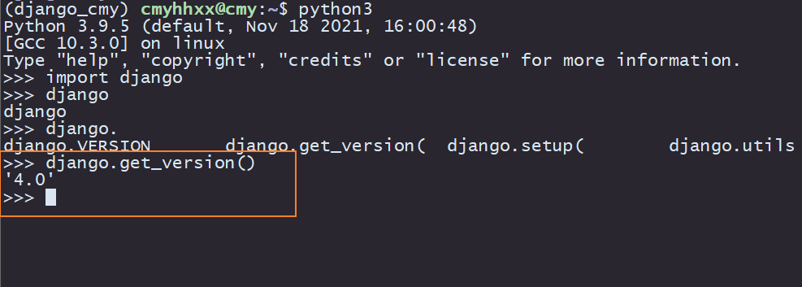
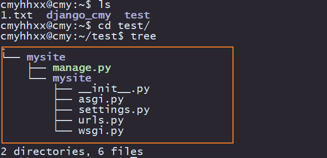
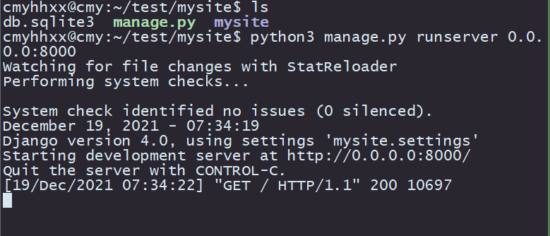
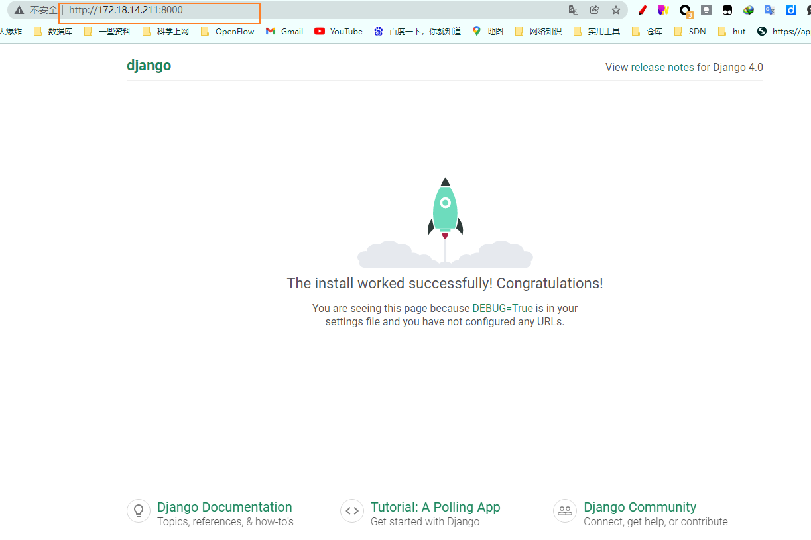
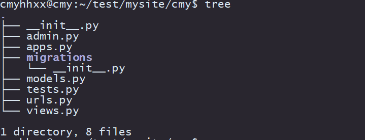
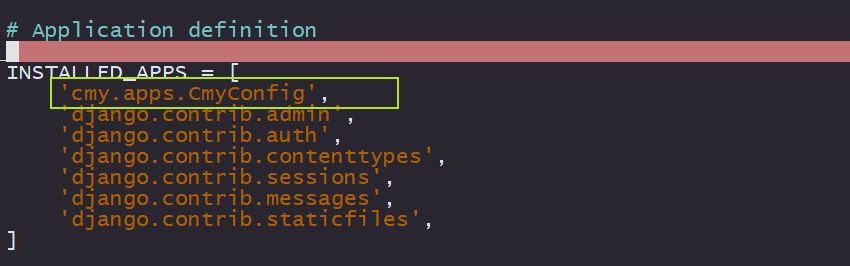
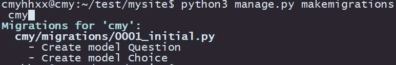
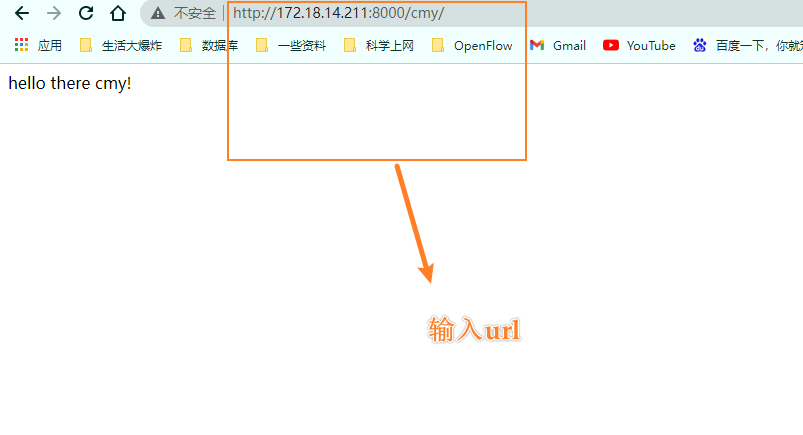
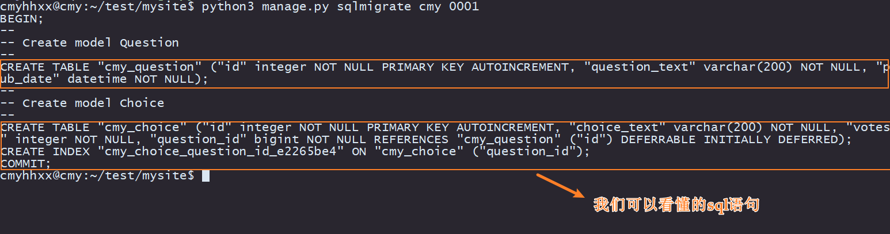
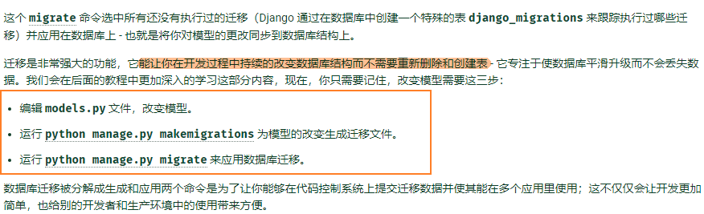

# Django cmy官方文档来了！冲
## Django 安装
祖传docker不解释，创建python venv django_cmy，装包很方便  
二重隔离，贴心，放心。
创建python venv
```cmd
sudo apt update
sudo apt install python3-venv
python3 -m venv django_cmy
```
家目录下会出现django_cmy的目录，执行`source django_cmy/bin/activate`激活venv，进入到venv的世界。退出venv请执行`deactive`
>啥是venv？  
官方解释：
每个虚拟环境都有自己的 Python 二进制文件（与用于创建此环境的二进制文件的版本相匹配），并且可以在其站点目录中拥有自己独立的已安装 Python 软件包集。  
人话：
一个独立的环境，里面安装的python包与外部隔离。

```cmd
python3
import django
django.get_version()
```
成功安装：

 

## mysite 入门
1. 进入你想放网站的目录，执行`django-admin startproject mysite`
2. tree，看一下目录结构  
    

    - mysite 是你项目的容器，根目录对Django没有影响，你可以随意更改
    - manage.py 一个让你用各种方式管理Django的命令行工具 
    - mysite目录 一个纯python包，它的名字就是当你引用它内部任何东西需要用到的python包名（mysite.urls)
    - mysite/\_\_init__.py 一个空文件，告诉python这个目录是一个python包
    - mysite/setting.py Django项目的配置文件
    - mysite/urls.py Django项目的URL声明，就像你网站的目录
    - mysite/wsgi.py 作为你项目运行在WSGI兼容的web服务器上的入口
    - mysite/asgi.py 作为你项目运行在ASGI兼用的web服务器上的入口

3. 成功开启server

 

 

4. 创建一个应用
    - 你的应用可以放在任何python路径中定义的路径，在manage.py同级目录下创建应用，这样就可以作为顶级模块导入，而不是作为mysite的子模块导入
    - 执行`python3 manage.py startapp cmy`后，会产生一个python包，自己新建urls.py，之后目录结构如下：

         

    - mysite/settings.py配置：
        - TIME_ZONE:'Asia/Shanghai'
    - 编写views.py
        ```python
        from django.http import HttpResponse

        def index(request):
            return HttpResponse("hello there cmy!")
        ```
    - 编写urls.py
        ```python
        from django.urls import path
        from . import views

        urlpatterns = [
        path('', views.index, name="index"),
        ]
        
        ```
    - 在URLconf文件中指定我们创建的cmy.urls模块。
        > 函数 include() 允许引用其它 URLconfs。  
        每当 Django 遇到 include() 时，它会截断与此项匹配的 URL 的部分，并将剩余的字符串发送到 URLconf 以供进一步处理。
        我们设计 include() 的理念是使其可以即插即用。因为投票应用有它自己的 URLconf( polls/urls.py )，他们能够被放在 "/polls/" ， "/fun_polls/" ，"/content/polls/"，或者其他任何路径下，这个应用都能够正常工作。
    ```python
        from django.contrib import admin
        from django.urls import path, include
        
        urlpatterns = [
            path('cmy/', include('cmy.urls')),
            path('admin/', admin.site.urls),
        ]
    ```
    **当包括其它 URL 模式时你应该总是使用 include() ， admin.site.urls 是唯一例外。**
    - 创建模型
        - 在Django里写一个数据库驱动的Web应用第一步就是定义模型，也就是数据库设计和附加其他的元数据。
        - 在投票应用中，需要创建两个模型，问题和选项。
        - 问题包括问题描述和发布时间
        - 选项包括选项描述和当前票数
        ```python 
        from django.db import models
        
        class Question(models.Models):
            question_text = models.CharField(max_length=200)
            pub_date = models.DateTimeField('date published')
        
        class Choice(models.Models):
            qustion = models.ForeignKey(Qustion, on_delete=CASCADE)
            choice_text = models.CharField(max_length=200)
            votes = models.IntegerField(default=0)
        ```
    
    - 将cmy这个app加载到mysite/settings.py中的INSTALLED_APPS中  
    添加`'cmy.apps.CmyConfig',`
         
    - 现在你的Django项目会包括cmy这个应用，回到mysite根目录，执行`python3 manage.py makemigrations cmy `
    
         
    
    - 接着执行`python3 manage.py migrate`
    - 重启服务`python3 manage.py runserver 0.0.0.0:8000`
    
         
        
    - makemigrations迁移命令会执行哪些sql语句呢？
        - 什么是迁移？  
            迁移是Django对于模型定义，也就是你的数据库结构的变化的存储形式  
        - 执行迁移后，产生了哪些sql语句

             
        
        -  
    - 可以通过`python3 manage.py shell`来更好地了解Django为我们创建的各种API
    - 可以给模型添加符合逻辑的自定义方法
