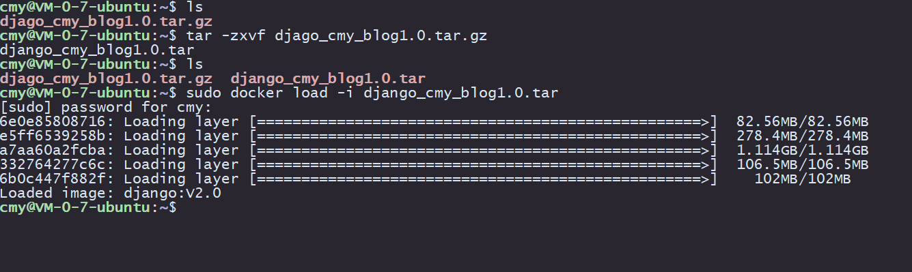

# 博客项目部署
## 购买一台云服务器
## 配置云服务器
1. 安装docker
2. 安装vim
3. 安装tmux
4. 添加用户
5. 配置ssh免密登录

## docker迁移
1. 将本地docker容器 commit
2. 将commit好的IMAGES save
3. 将save的tar包压缩
4. scp 上传到云服务器i
5. 云服务器解压docker压缩包
6. 云服务器load docker镜像的tar包
7. 云服务器利用load 好的镜像运行容器，注意开放端口
8. 镜像加载成功
     

## 配置nginx
1. 容器内安装nginx
2. 配置nginx
3. 配置django
4. 配置静态文件目录

## 配置域名
