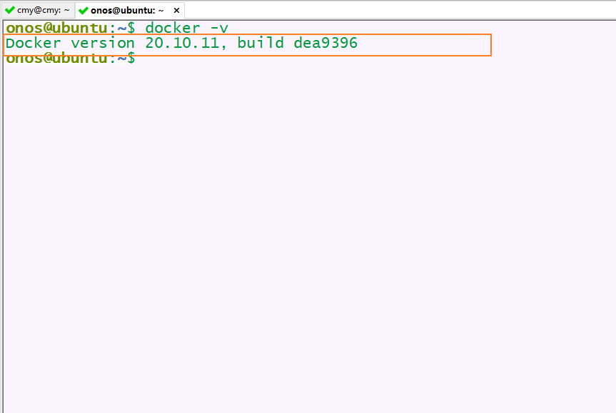
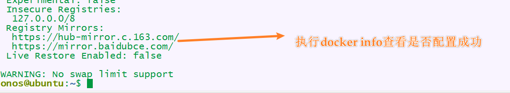

# docker ubuntu 20.04 个人镜像配置
## 配置安装docker
1. 参见官网步骤，[docker_getstarted](https://docs.docker.com/engine/install/)。
安装成功结果：



2. 安装完成后，需要进行一些必要的配置
```linux
sudo usermod -aG docker $USER  ## 为了避免每次使用docker都要sudo
sudo chmod 666 /var/run/docker.sock  ## 如果出现sock报错
```
3. 配置镜像加速
```
sudo vim /etc/docker/daemon.json

## 添加以下内容：

{
  "registry-mirrors": [
    "https://hub-mirror.c.163.com",
    "https://mirror.baidubce.com"
  ]
}

## 保存退出


## 重新加载配置文件和重启docker

sudo systemctl daemon-reload
sudo systemctl restart docker

```

配置成功结果：



---

## 配置个人docker镜像
```info
# ubuntu 21.04

# application list

## vim
## net-tools
## tumx
## git
## openssh-server
## python 3
## jdk 1.8 && jdk 11
## mysql 8
## ryu
## OpenDayLight

# conf list

## .brashrc
## .tumx-conf
## .vimrc


```
