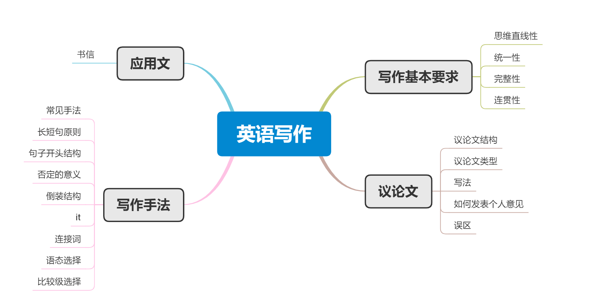

# 英语写作教程
## 思维导图

 

## 写作基本要求
### 思维直线性
1. 英语语篇一般按直线展开(linear)，通常包含四个部分：导入，主题，支撑，结论。
2. 为了突出重点，将写作步骤分为以下：
    - 陈述中心思想
    - 按直线展开，分点说明中心思想
    - 利用一定的衔接手段，将各个部分连接起来

### 统一性
1. 全篇各个段落都为一个中心思想服务，而且各个段落都围绕该段落的中心句来写。
2. 造成段落松散的原因是句子结构杂乱。解决办法：将某些句子变成修饰或限定成分，紧缩句子结构。
3. 为了突出中心句，中心句必须高度概括所在段落，不要写无关的叙述和说明性文字。

>Eating has a crucial influence on people's physical and mental health.  
>Eating patterns reflect the social status of people of different social ranks.

主题句的概括性和具体性是段落和文章发展的基石。

### 完整性
1. 有了主题句，一个段落必须有若干个拓展句，使主题思想得到充分展开，从而读起来完整。
2. 后面的拓展句是对主题句各个方面的解释，论证，而不是无关的其他说明

反例：
> There are many things to be done to honor senior citizens. In cities, senior citizens should enjoy some privileges, such as special seats on buses, reduced fares for entertainment and traveling, and other benefits. They are so old and weak, and they need respect and care from other groups of the society to fulfill the dreams of the life. But medical care is often beyond their financial competence.

可以看到，第一句作为主题句。但是从They are so old and weak 开始就是无关的其他说明，读者不知所云。

### 连贯性
1. 意义连贯，内在的逻辑连贯
    - 按时间先后排列(chronological arrangement)
    - 按位置远近排列(spatial arrangement)
    - 按逻辑关系排列(logical arrangement)
        - 按重要性 in order of importance
        - 由一般到特殊 general to specific
        - 由特殊到一般 specific to general
2. 形式连贯，使用具有连贯意义的词语
    - 重复前部分句子中重要的词语
    - 使用代词
    - 使用过渡性词语和过渡性语句
        - 层进
            - first and formost
            - secondly to start with
            - besides in addition
            - finally
        - 例举
            - for instance
            - to illustrate as an illustration
            - as a matter of fact
        - 总结
            - in brief
            - in short
            - in a word
        - 让步
            - in spite of 
            - nevertheless
            - even so
        - 比较
            - by contrast
            - in comparison with
        - 转折
            - on the contrary
            - in contrast

## 议论文
### 议论文结构
1. Introduction：背景知识，中心句(15%)
2. Body：讨论和回答Introduction提出的问题(70%)
3. Concluding paragraph：总结观点，提出希望(15%)
### 议论文类型
1. 提纲式作文
    - 原因式
        - 第一段：引入话题，表明作者对此问题的看法或态度
        - 第二段：过渡性语言，概括全段主题；支持自己观点的论据
        - 第三段：结论
    - 分析解决式
        - 第一段：引入话题，表明作者对此问题的看法或态度
        - 第二段：过渡性语言，分析造成这种现象的原因
        - 第三段：过渡性语言，就上述问题的起因逐个给出办法或建议
        - 第四段：总结，发出倡议
    - 对比式
        - 第一段：引入话题，承认不同看法各自有各自的理由
        - 第二段：过渡性语言，陈述一方的观点或优点
        - 第三段：过渡性语言，陈述另一方的观点或缺点
        - 第四段：结论表明自己的立场
    - 驳斥式
        - 第一段：引出社会中存在的一种谬误现象或看法，提出自己的立场
        - 第二段：过渡性语言，实例例证该现象或看法的谬误所在
        - 第三段：重申自己的观点
2. 图表式作文
    - 写作模式
        - 第一段：描述图表，概括图表。本段不要体现具体数据，否则缺乏概括性
        - 第二段：用图表数据来论证第一段的主题，分析各个数据产生的原因
        - 第三段：分析预测走势
    - 开头段：As we can spot from in the chart, ...
    - 数据变化：reached a peak, bottomed out 
    - 变化程度：gradually, approximately, precisely, slight, steady
    - 分词结构：使用分词结构或介词结构表示伴随，来达到简洁紧凑的目的
    - 比较级，倍数，比例关系：be in a diret ration to, be in an inverse ration to 
### 写法
1. 文章比例说明
    - 开头15%
    - 主体70%
    - 结尾15%
2. 开头写法
    - 现象法：Nowadays, our society is witnessing more and more {...}
    - 观点法：Researchers have established the concept that {...}
    - 正反对比论证法：There is a public controversy nowadays over the issue of {...} . Those who object to the idea argue that {...} . But people who favor {...} argue that {...} .
    - 数据法：Such statistics present an indisputable fact that {...}
3. 主体段落写法
    - 并列法：first and foremost; secondly to start with; besides in addition; finally
    - 比较对照法：分别列出某事物或观点的优点和缺点，在比较中得出结论
    - 因果法：分析几个构成事件的原因，来解释某个结果的形成
    - 批驳法：用充分的事实理由作论据，对开头段提出的观点进行批驳
4. 结尾的写法(to summarize,)
    - 总结
        - From what has been discussed above, we may safely draw the conclusion that {...}
    - 呼吁
        - There is no denying that considerable attention must be paid to the plight of {...}
    - 预测
        - {...} will exert a profound influence on {...}
### 如何发表个人观点
1. 支持
    - From where I stand, I embrace the idea that {...}
2. 反对
    - Contrary to the generally accepted ideas, I argue that {...}
### 误区
1. 过多的主观性语言和议论
2. 将个人体会作为论据
3. 空喊口号，论据不足
4. 口语化语言过多

## 写作手法
### 长短句结合
### 改变句子开头
### 否定的意义
### 倒装句
### 词语的选择
### 比较级结构
