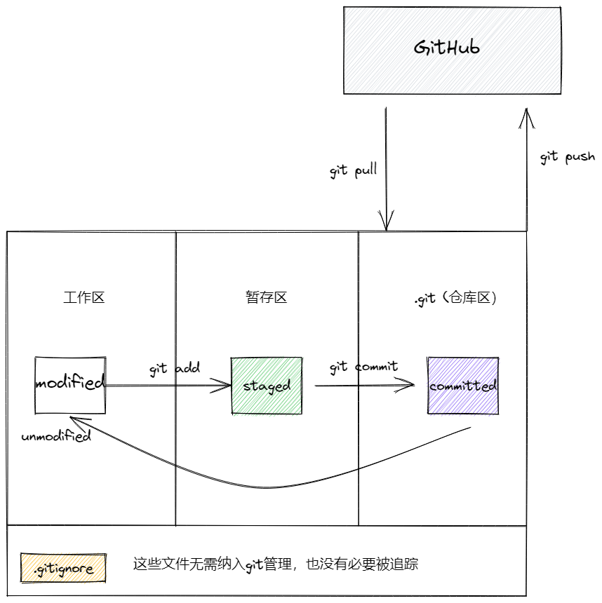
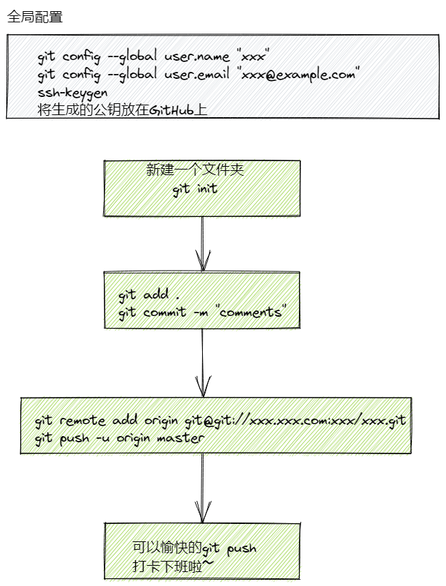

# Git 基础教程
> 俺们作为程序员，最重要的本领就是掌握git，只有掌握了git，才能更好管理我们的代码！
## 通过man来学习git
## 在此之前，需要了解一些基本概念
### committed, modified, staged



根据这张图片，可以看出，最最基础的git 命令一共就13条
```text
1. git config --global user.name "NAME" // 设置git用户名
2. git config --global user.email "EMAIL" // 设置git用户邮箱
3. git init // 在本地初始化git
4. git add . // 将本层所在目录下所有的内容加到暂存区（除了.gitignore中的内容）
5. git commit -m "MESSAGES" // 将暂存区的内容持久化
6. git remote add origin git@git.xxx:xxx/xxx.git //添加远程仓库
7. git push -u origin master //仅第一次push需要加origin和master参数
8. git push // 将暂存区的内容推送到远程仓库
9. git pull // 从远程仓库的分支与当前仓库的分支合并
10. git branch // 查看当前所在分支
11. git log // 查看提交记录
12. git status // 查看仓库状态
13. git clone // 从远程仓库克隆
```
注意：
1. 你设置的user.name 和 user.email 要和你GitHub上的一致，不然提交的时候很丑。
2. 上述命令的顺序是混乱的，不能直接照敲。

如果你要推送一个现有的仓库至GitHub，步骤：




## git push的大小写 坑！
git中的push是默认不区分大小写的，然后我把docker 文件夹改成 Docker，
兴致冲冲的去GitHub上看我的笔记，怎么docker还是docker，本来无所谓，但谁让我是强迫症，我看的那叫一个难受，我就想给他改过来。但是网上有些博客真的害人。
我看那些写博客的人都瓜兮兮的，我直接按照博客git mv， 然后我就裂开了，后来我找到一个不那么瓜的人写的博客，说git 默认不区分大小写，我们只需要将区分大小写的全局设置打开，在git push就行，我一看这个就靠谱，前面一个git mv的也太捞了。
>git config --get core.ignorecase # 查看git 的设置  
>git config core.ignorecase false # 设置大小写敏感  
>git rm -r --cached <目录/文件>  # 远程有俩相同目录，通过这种方式清除掉，然后提交记录


我得到了两个docker目录，一个大写的，是我想要的，一个小写的。我这里惯性思维，直接删，然后再pull到本地，我真牛。结果pull到本地，permission denied。
我沉思了一会，才想起来， 我他妈改过GitHub的密码，没在windows本地改呢。我去控制面板里找到凭证管理，windows凭证管理，输入了修改过后的密码。
我以为大功告成，结果我在本地完美，全是大写的目录，强迫症看了都说好，我在push上去，提示版本不一致，让我修改，我修改个球， 我直接git push -f， 暴力出奇迹，我满心欢喜，上去一看，我在网页删掉的两个文件又又回来了，又折腾了一次git pull ， git push -f ，还是不行。 我气死了。最后我找到了解决办法，git rm -r --cached <目录名\>,然后git push。解决！将强迫症的意志继承到底！


## man git
```text
DECSRIPTIONS:
Git is a fast, scalable, distributed version control system with a rich command set.


```
