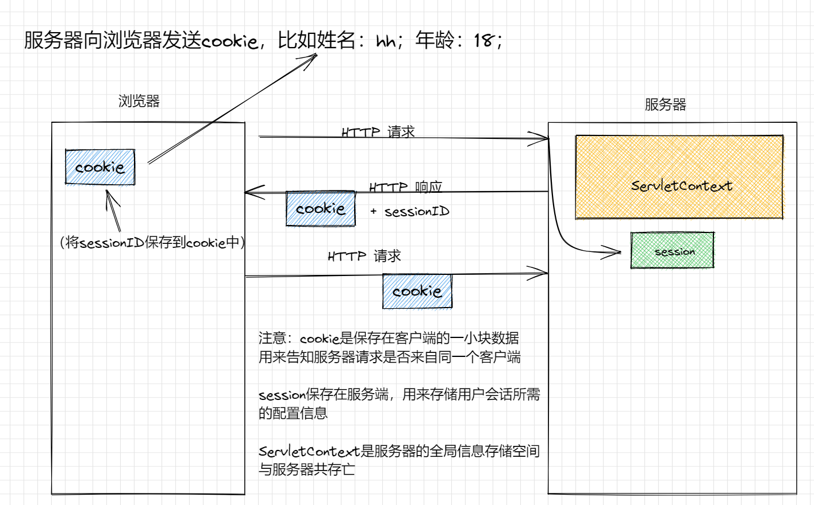

# Servlet docs
## Servlet 简介
## Servlet 是什么
Servlet是使用java编写的运行在服务器端的程序。主要用来处理客户端传来的http请求，并返回一个响应。
Servlet由Servlet容器提供，如Tomcat会将Servlet动态的加载到服务器上。

Servlet请求首先发给HTTP服务器，HTTP服务器只负责静态页面的解析
因此，Servlet请求会转交给Servlet容器，Servlet容器会根据映射关系调用相应的Servlet，将处理结果返回给Servlet容器，通过HTTP服务器发回给客户端。
## Servlet 生命周期

 

1. 第一个到达服务器的HTTP请求被委派到Servlet容器
2. Servlet容器在调用service方法前，加载servlet
3. Servlet容器处理多个线程产生的多个请求，每个线程执行单一的service方法

## HTTP请求
1. 请求中包含哪些内容
    - Accept， 指定浏览器或其他客户端可以处理的MIME类型
    - Accept-Charset， 指定浏览器可以显示的字符集
    - Cookie，之前服务器发送给浏览器的cookie返回给服务器
    - Referer， 相当于一个标志，如果发生了跳转会将当前页面URL放在Referer字段
2. HttpServletRequest中有哪些方法
    - request.getCookies()，返回一个cookie对象数组，包含客户端中所有的cookie对象
    - request.getAttributeNames()，返回一个枚举，包含提供给该请求可用的属性名称
    - request.getHeaderNames()， 返回一个枚举，包含该请求中所有的头名
    - request.getParameterNames()， 返回一个String类型枚举，包含该请求中所有参数的名称
    - request.getSession()， 返回与该请求关联的Session对象，没有则创建
    - request.getAttribute(String name)， 返回已命名对象属性的值，没有则为null
    - request.getContextPath()，返回指示改请求上下文的请求URI部分
    - request.getHeader()， 以字符串形式返回指定的请求头的值
    - request.getMethod()，返回请求的HTTP方法名称
    - request.getParameter()， 以字符串形式返回请求参数的值
    - 还有一些不常用，自己查~
## HTTP响应
1. 响应中包含哪些内容
    - Allow， 服务器支持的请求方法
    - Cache-Control，缓存方式
    - Content-Type ，响应文档的MIME类型
    - Last-Modified，响应文档的最后修改时间
    - Location， 通知浏览器到哪里拿到新的文档
    - Refresh， 指定浏览器刷新的秒数
    - Set-Cookie ， 指定一个与页面关联的cookie
    - 还有一些不常用，自己查~
2. HttpServletResponse中有哪些方法
    - response.encodeRedirectURL(Sring url)， 为sendRedirectURL编码
    - response.encodeURL(String url)， 为URL编码
    - response.addCookie(Cookie cookie)， 将指定的cookie添加到响应中去
    - response.addDateHeader(String name, long date)， 添加一个有名称和日期的响应头
    - response.addHeader(String name, String value)，添加一个有名称和值的响应头
    - response.flushBuffer()， 强制将任何缓冲区的内容写入客户端
    - response.reset()， 清除响应中基础缓冲区的内容，不包括响应头和状态码
    - response.sendRedirect(String location)， 向客户端发送重定向URL
    - response.setContentType(String type)， 设置被发送到客户端的响应的内容类型
    - response.setHeader(String name, String value)， 设置一个给定名称和值的响应报头
    - response.setStatus()， 为该响应设置状态码
    - 还有一些不常用，自己查~

## Servlet Cookie
### Servlet提供了cookie对象，该对象有如下方法：(Cookie cookie = new Cookie();)
1. cookie.setDomain(String pattern)， 设置cookie适用的域
2. cookie.getDomain()， 获取cookie适用的域
3. cookie.setMaxAge(int expiry)， 设置cookie过期时间（单位：秒），不设置，仅在当前session有效
4. cookie.getMaxAge()， 返回cookie的最大生存周期
5. cookie.getName()， 返回cookie的名称
6. cookie.setValue(String newValue)， 设置与cookie关联的值
7. cookie.getValue()， 获取与cookie关联的值
8. cookie.setPath(String uri)， 设置cookie适用的路径
9. cookie.getPath()， 获取cookie适用的路径

## Servlet Session
### Servlet提供了Session对象，该对象有如下方法：(HttpSession session = request.getSession();)
1. session.getAttribute(String name)， 获取该session对象中具有指定名称的对象
2. session.getId()， 返回该Session对象的sessionID
3. session.getLastAccessedTime()， 返回客户端最后一次与服务端通信的时间距离1970-1-1毫秒为单位的时间
4. session.invalidate()， 使该session失效，解除绑定到它上的任何一个对象
5. session.removeAttribute(String name)， 从session会话中移除指定名称的对象
6. session.isNew()， 返回客户端是否知道该seesion会话，是返回FALSE
7. session.setAttribute(String name, Object value)， 将名称为name的value对象绑定到该session对象
## Servlet Context
### Servlet提供了一个ServletContext对象，该对象是一个全局的存储信息的空间(ServletContext servletcontext = this.getServletContext())
1. servletcontext.getAttribute(String name)， 返回一个名称为name的对象
2. servletcontext.setAttribute(Sting name, Object value)， 将value对象放入servletcontext对象中，取名为name
3. servletcontext.removeAttribute(String name)， 在servletcontext空间中删除名称为name的对象

## cookie session ServletContext 关联

