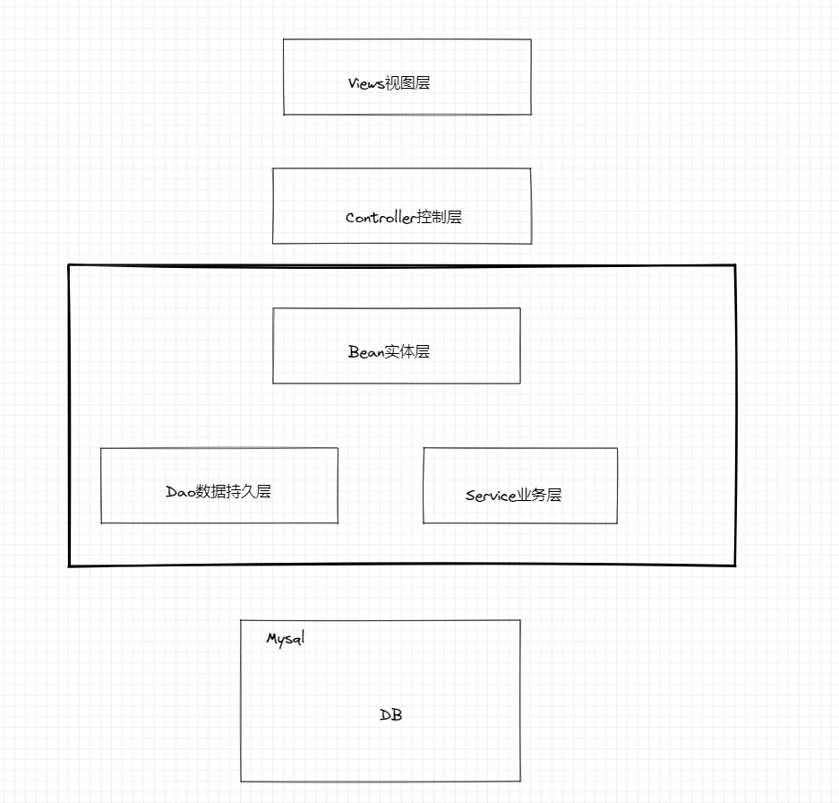
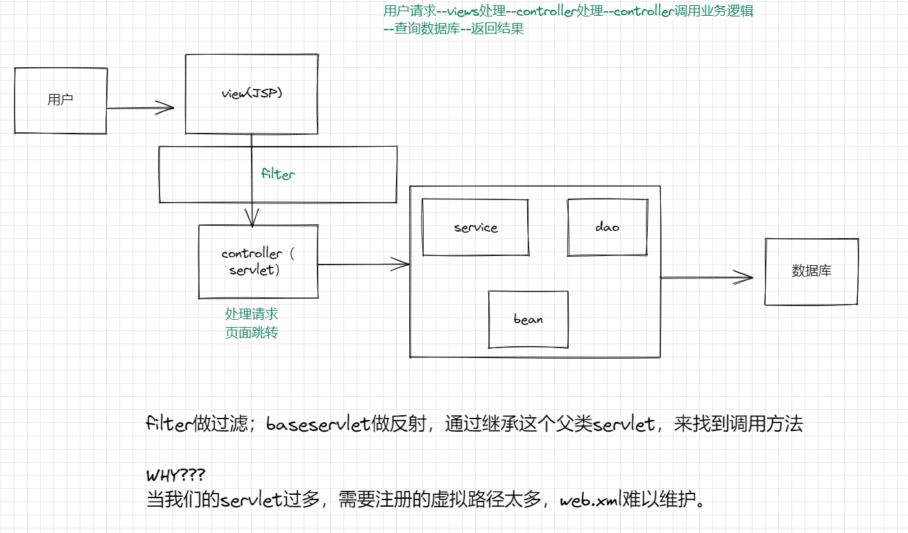

# 基于tmall的在线教育商城
## 效果演示
### 该商城基于用户实现的功能有：
1. 用户登录
2. 用户注册
3. 用户密码MD5加密
4. 商品的分类浏览
5. 商品的加入购物车
6. 商品详情页
7. 商品提交订单(为实现支付，时间和精力缘由，支付宝支付接口有点小问题)

### 该商城基于管理员实现的功能有：
1. 商品添加
2. 商品删除
3. 商品修改
4. 商品查询
5. 用户查询
6. 用户分页展示

## 代码结构与逻辑
### 代码结构：MVC三层架构

 

### 网站运行的流程

 

hint：  
分页展示如何实现的？  
用户密码加密如何实现的？  
filter作用？
路由反射怎么做的？
jsp页面如何拼接？
哪里需要改进？
