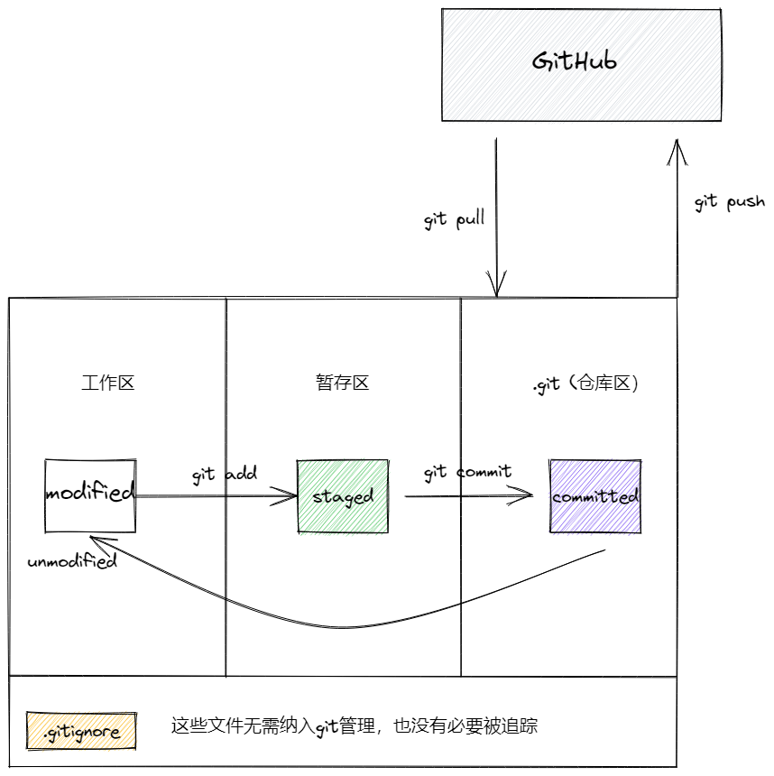
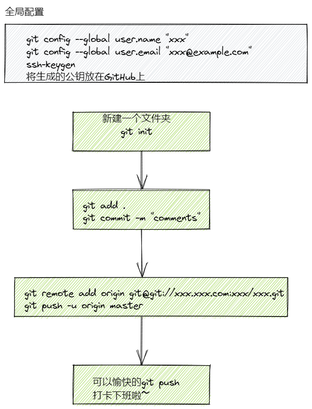

# Git 基础教程
> 俺们作为程序员，最重要的本领就是掌握git，只有掌握了git，才能更好管理我们的代码！
## 通过man来学习git
## 在此之前，需要了解一些基本概念
### committed, modified, staged



根据这张图片，可以看出，最最基础的git 命令一共就13条
```text
1. git config --global user.name "NAME" // 设置git用户名
2. git config --global user.email "EMAIL" // 设置git用户邮箱
3. git init // 在本地初始化git
4. git add . // 将本层所在目录下所有的内容加到暂存区（除了.gitignore中的内容）
5. git commit -m "MESSAGES" // 将暂存区的内容持久化
6. git remote add origin git@git.xxx:xxx/xxx.git //添加远程仓库
7. git push -u origin master //仅第一次push需要加origin和master参数
8. git push // 将暂存区的内容推送到远程仓库
9. git pull // 从远程仓库的分支与当前仓库的分支合并
10. git branch // 查看当前所在分支
11. git log // 查看提交记录
12. git status // 查看仓库状态
13. git clone // 从远程仓库克隆
```
注意：
1. 你设置的user.name 和 user.email 要和你GitHub上的一致，不然提交的时候很丑。
2. 上述命令的顺序是混乱的，不能直接照敲。

如果你要推送一个现有的仓库至GitHub，步骤：




## man git
```text
DECSRIPTIONS:
Git is a fast, scalable, distributed version control system with a rich command set.


```
