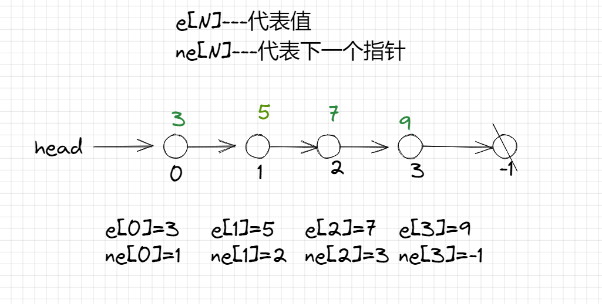
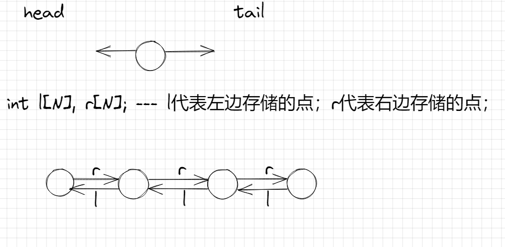
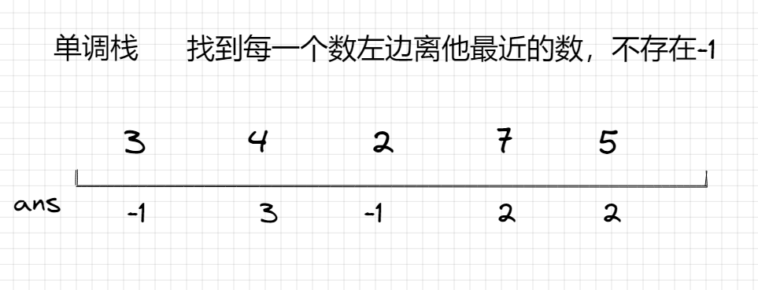
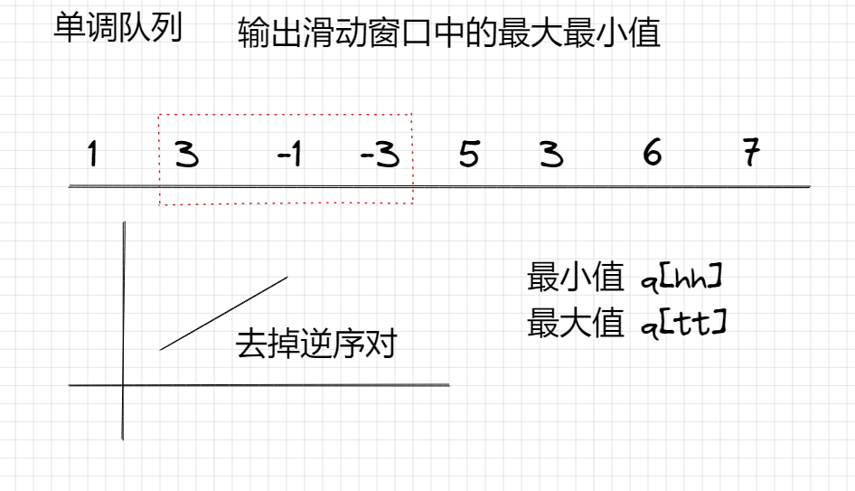
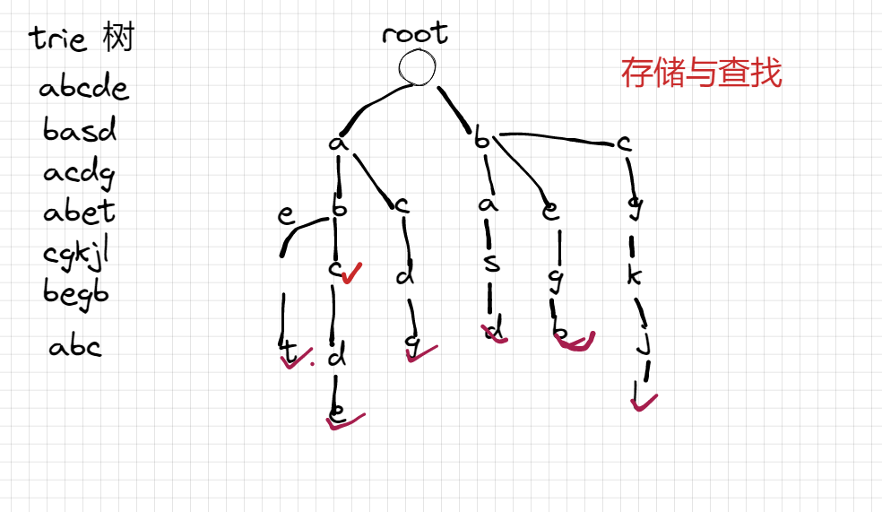
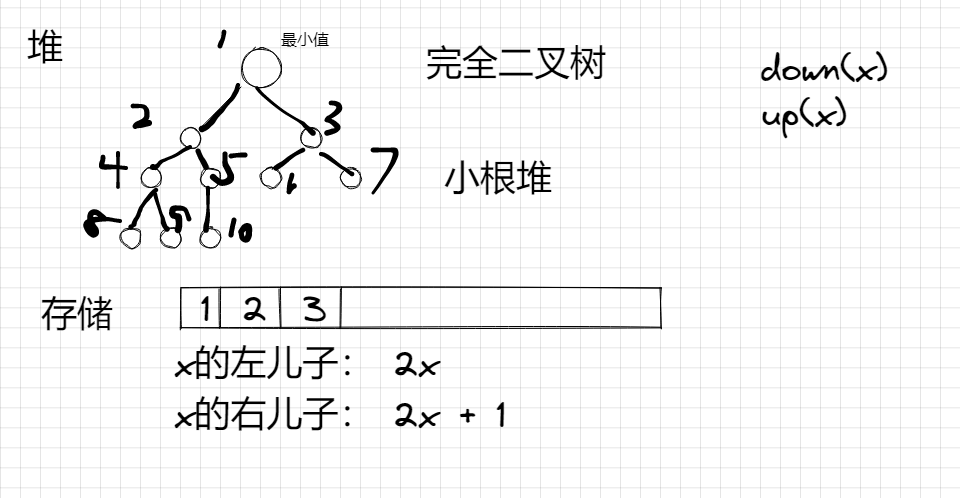

# 算法基础 与 数据结构
## 基础算法
1. 排序
2. 二分
3. 高精度
4. 前缀和与差分
5. 双指针
6. 位运算
7. 离散化
8. 区间合并

## 数据结构
1. 链表与邻接表（数组模拟）
    - 单链表：邻接表，存储图和数；
         
        注意下标从0开始还是从1开始
        
        ```c++
        #include <iostream>
        
        using namespace std;
        
        const int N = 100010;
        
        // head 表示头结点的下标
        // e[i] 表示结点i的值
        // ne[i] 表示结点i的next指针是多少
        // idx 表示当前已经用到了哪个点
        int head, e[N], ne[N], idx;
        
        // 初始化
        void init()
        {
            head = -1;
            idx = 0;
        }
        
        // 将x插入到头结点
        void add_to_head(int x)
        {
            e[idx] = x;
            ne[idx] = head;
            head = idx;
            idx ++;
        }
        
        // 将x插入到k后
        void add(int k, int x)
        {
            e[idx] = x;
            ne[idx] = ne[k];
            ne[k] = idx;
            idx ++;
        }
        
        // 将k后面一个节点删除
        void remove(int k)
        {
            ne[k] = ne[ne[k]];
        }
        
        int main()
        {
            int m;
            cin >> m;
            init();
        
            while(m --)
            {
                int k , x; 
                char op;
        
                cin >> op;
        
                if (op == 'H')
                {
                    cin >> x;
                    add_to_head(x);
                }
        
                else if (op == 'D')
                {
                    cin >> k;
                    if(!k) head = ne[head];
                    else remove(k - 1);
                }
        
                else
                {
                    cin >> k >> x;
                    add(k - 1, x);
                }
            }
            for(int i = head; i != -1; i = ne[i]) cout << e[i] << ' ';
            cout << endl;
            return 0;
        }
        ```
        
        
        
    - 双链表：优化问题
         

2. 栈与队列（数组模拟）
    - 栈 先进后出
    - 单调栈
         

    - 队列 先进先出
    - 单调队列
         

3. KMP
     

    ```c++
    // 模式串s，长度为m；模板串p，长度为n，下标均从1开始
    char p[N], s[M];
    int n, m, ne[N];
    
    void kmp() {
        // 构造ne数组
        // ne[i] = j 表示 p[1:j] == p[i - j:i]
        for (int i = 2, j = 0; i <= n; i ++ ) {
            while (j && p[i] != p[j + 1]) j = ne[j];
            if (p[i] == p[j + 1]) j ++ ;
            ne[i] = j;
        }
    
        for (int i = 1, j = 0; i <= m; i ++ ) {
            while (j && s[i] != p[j + 1]) j = ne[j];
            if (s[i] == p[j + 1]) j ++ ;
            if (j == n) {
                // p到头了，匹配成功
            }
        }
    }
    ```

    

4. Trie 树  
    高效的存储和查找字符串集合的数据结构

     

5. 并查集  
    - 将两个集合合并
    - 询问两个元素是否在一个集合当中

    基本原理：
    每个集合用一棵树表示，树根的编号就是整个集合的编号。每个节点存储它的父节点，p[x]表示x的父节点

    问题1：如何判断树根： if (p[x] == x)  
    问题2：如何求x集合的编号: while (p[x] != x) x = p[x];  
    问题3：如何合并两个集合： px 是x集合的编号， py是y集合的编号， p[x] = y

    优化问题2： 路径压缩
    tips: 用字符串读字母

    ```c++
    // pa[x] = y x所属集合的根节点是y
    int pa[N];
    
    // 路径压缩的查找根节点操作
    int find(int x) {
        if (pa[x] != x) pa[x] = find(pa[x]);
        return pa[x];
    }
    
    // 初始化，最开始每个结点自身构成一个集合，它的根节点是自己
    for (int i = 1; i <= n; i++) pa[i] = i;
    
    //合并两个集合
    int r_a = find(a), r_b = find(b);
    pa[r_a] = r_b;
    ```

    

6. 堆
    - 插入一个树: heap[ ++ size] = x;up(size);
    - 求集合当中最小值: heap[1]
    - 删除最小值:  heap[1] = heap[size]; size--;down(1);
    - 删除任意一个元素: heap[k] = heap[size]; size--; down(k); up(k);
    - 修改任意一个元素: heap[k] = x; down(k); up(k);

    

7. 哈希表
    - 存储结构
    - 字符串哈希方式

8. STL使用
    - vector 变长数组 倍增的思想
        - size() 返回元素个数
        - empty() 返回是否为空
        - clear() 清空数组
        - front()/back()
        - push_back()/pop_back()
        - begin()/end()
        - []
        - 支持比较运算
    - pair<int, int> 二元组
        - p.first/p.second
        - 支持比较运算 字典序
    - string 字符串
        - size()/length() 返回字符串长度
        - empty() 返回是否为空
        - clear() 清空
        - substr(开始的位置，长度) 子串
        - c_str() 转换为字符串
    - queue 队列
        - size() 返回元素个数
        - empty() 返回是否为空
        - push() 向队尾插入一个元素
        - pop() 弹出队头
        - front() 返回队头
        - back() 返回队尾
    - priority_queue 优先队列 默认大根堆
        - push() 插入一个元素
        - top() 返回堆顶元素
        - pop() 弹出堆顶元素
        - 定义成小根堆：priority_queue<int, vector<int> greater<int>> q;
    - stack 栈
        - push() 向栈顶压入一个元素
        - pop() 弹出栈顶
        - top() 返回栈顶
    - deque 双端队列
        - size()
        - empty()
        - clear()
        - front()/back()
        - push_back()/pop_back()
        - push_front()/pop_front()
        - begin()/end()
    - set map multiset multimap 基于平衡二叉树(红黑树) 动态维护有序序列
        - size()
        - empty()
        - clear()
        - begin()/end() ++ --
        - set multiset 
            - insert()
            - find()
            - count()
            - erase()
                - 如果输入的是一个数x，删除所有x
                - 如果输入的是一个迭代器， 删除迭代器
            - lower_bound()/upper_bound()
                - lower_bound() : 返回大于等于x的最小的数的迭代器
                - upper_bound() : 返回大于x的最小的数的迭代器
        - map multimap
            - insert() 插入的数是一个pair
            - erase() 输入的参数是pair或者迭代器
            - find() 
            - [] 时间复杂度O(logn)
            - lower_bound()/upper_bound()
    - unordered_set unordered_map unordered_mutiset unordered_mutimap
        - 与上面类似，增删改查时间复杂度O(1)
        - 不支持lower_bound()/upper_bound(), 迭代器的 ++ --
    - bitset 压位
        - bitset<10000> s;
        - count() 返回有多少个1
        - any() 判断是否至少有一个1
        - none() 判断是否全为0
        - set() 把所有位置1 set(k, v) 把第k位变成v
        - reset() 把所有位置0
        - flip() 等价与~ flip(k) 把第k为取反

## 搜索和图论

1. DFS
    深度优先搜索
    
2. BFS
    宽度优先搜索
    
3. 图论
    树与图的深度优先遍历
    树与图的广度优先遍历
    拓扑排序
    
4. 最短路
    - 单源最短路
        - 边权全为正数
            - 朴素Dijkstra算法
            
                ```c++
                #include <iostream>
                #include <cstring>
                
                using namespace std;
                
                const int N = 510;
                int g[N][N];
                int dist[N];
                bool st[N];
                
                int n, m;
                
                int dijkstra()
                {
                    // initialize the dist to infinity
                    memset(dist, 0x3f, sizeof dist); 
                    
                    // the dist of starting point is 0
                    dist[1] = 0;
                    
                    // need n times iterations
                    for (int i = 0; i < n; i ++ )
                    {
                        // in order to find the first point, it is necessary to set t = -1;
                        // t is used to find the smallest dist point number among all st[] == false;
                        int t = -1;
                        
                        // find out the closest point
                        for (int j = 1; j <= n; j ++ )
                        	if (!st[j] && (t == -1 || dist[t] > dist[j]))
                                t = j;
                        
                        // st[] = true means this point is the closest point currently
                        // from anonther way, st[] = true means this point had been used to update other dists
                        st[t] = true;
                        
                        // update other point with t , if the distance through t is better
                        for (int j = 1; j <= n; j ++ )
                            dist[j] = min(dist[j], dist[t] + g[t][j]);
                    }
                    
                    if (dist[n] == 0x3f3f3f3f) return -1;
                    return dist[n];
                }
                
                int main()
                {
                    scanf("%d%d", &n, &m);
                    
                    memset(g, 0x3f, sizeof g);
                    
                    while (m -- )
                    {
                        int a, b, w;
                        scanf("%d%d%d", &a, &b, &w);
                        // only take the smallest edge to elimate the duplicate edge and self-loops
                        g[a][b] = min(g[a][b], w);
                    }
                    
                    int distance = dijkstra();
                    cout << distance << endl;
                    
                    return 0;
                }
                ```
            
                
            
            - 堆优化Dijkstra算法
            
        - 存在负边权
            - Bellman-Ford
            - SPFA
        
    - 多元汇最短路
        - Floyd算法
    
5. 最小生成树
    - Prim算法
        - 朴素版(稠密图)
        - 堆优化版(稀疏图)
    - Kruskal算法(稀疏图)
    
6. 二分图
    - 染色法
    - 匈牙利算法
    

## 数学知识

1. 数论
    - 质数
        - 定义
        - 判定
        - 分解质因数
        - 朴素筛法 时间复杂度O(nlglgn)
        - 埃氏筛法 时间复杂度O(n)
        - 线性筛法
    - 约数
        - 求一个数所有的约数
        - 约数个数  推公式
        - 约数之和 秦九韶算法
        - 欧几里得算法
    - 欧拉函数
        - 公式
        - 容斥原理证明
        - 欧拉定理
        - 费马定理
    - 快速幂
    - 拓展欧几里得
    - 中国剩余定理
2. 高斯消元
3. 组合数
4. 容斥原理
5. 博弈论


## 动态规划
1. 背包问题 如果用到上一层的状态，从大到小枚举体积；如果用到本层的状态，从小到大枚举体积。
    - 01背包 每件物品最多使用一次
    - 完全背包 每件物品有无限个 注意递推，与01背包相似 
    - 多重背包 每件物品有有限个 是01背包的拓展 有二进制优化方式
    - 分组背包 枚举第i组物品选哪个 数量可能为0
2. 线性DP
    - 数字三角形
    - 最长上升子序列
    - 最短编辑距离 f[i][j]集合表示所有a[1~i] 变成 b[1~j] 的操作方式的集合
    - 编辑距离
3. 区间DP
4. 计数类DP
5. 状态压缩DP
6. 树形DP
7. 记忆化搜索


## 贪心
1. 区间问题
    - 区间选点
    - 最大不相交区间数量
